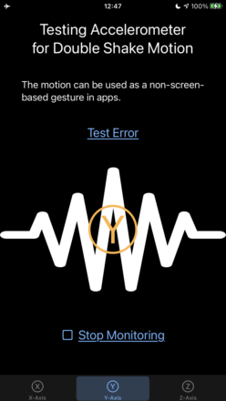
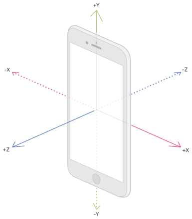

# Core Motion Double Shake Gesture Detection Demo

    
    
     

Our project has multiple purposes:

1. Share our Core Motion algorithm for continuous detection of user activity while using minimal memory.

    - We limit our storing of samples during monitoring while reading data one hundred times per second (100 Hz).
    - The original Objective-C code was ported from one of our apps published on the App Store.

2. Demonstrate our App Runner technique for acting like a microscope revealing state handling patterns in an app.

    - It replaces manual testing and other UI testing techniques.
    - It can automatically generate demonstration videos.
    - It is the same technique we used to deliver software to millions of devices.

If your app is modeled with view models, declarative views, and reactive streams, you have all the ingredients for advanced UI and state testing.
Our app runner technique reveals state handling patterns normally missed by manual testing and other UI testing techniques.
It is like having a mob of testers. We highly encourage you to try it because it will show you things you never knew about your app.

## Background

The mobile accelerometer has various practical uses such as detecting changes in motion, orientation, and environment. This technology can be utilized to enhance gaming and virtual reality, navigation and location, as well as fitness tracking. Additionally, it has health and safety applications including detecting tremors in Parkinson's patients, seizures in epileptic patients, changes in posture, falls and crashes.

In SwiftUI, we use the accelerometer to detect a custom gesture of a user shaking their device in a double shaking motion. Our project represents a clean, modern approach to iOS development and is fun to play with.

We require a double motion to distinguish a user's signal in a noisy background of detections sensitive to small movements.
As an example, the Z-axis for an iPhone or iPad corresponds to a perpendicular line projected through the face of the screen when it is positioned parallel to the ground, like a tabletop. Therefore, we can detect a double shake motion by monitoring the Z-axis for two consecutive peaks.

- We show a waveform image when we detect a double shake motion.
- The motion can be made with a crisp, double wrist flick, with the final move a little snappier, within a given time window.
- We generate haptic feedback when a gesture is successfully detected.

Please find some notes about the detector listed below.

- The detector has parameters for fine-tuning the gesture.
- Continuously monitoring the accelerometer results in constant CPU usage, about 6%, as measured by Xcode's CPU monitor.

## Install

    $ git clone https://github.com/d108/Core-Motion-Gesture.git
    $ cd Core-Motion-Gesture
    $ open Core-Motion-Gesture.xcodeproj

## Project notes

- SwiftUI and Combine
- MVVM
- Minimum deployment = iOS 14.0

Our app's architectural layers are cleanly separated, enabling smooth handling of all axes, even though we initially coded for only one axis.

## Code linting and formatting

Since brace style is a matter of personal preference, I have included scripts
and configurations to lint and format to either the "next line," requires
[SwiftFormat](https://github.com/nicklockwood/SwiftFormat), or "end of line,"
requires [swift-format](https://github.com/apple/swift-format). 

To use, run the following commands:

    $ cd Core-Motion-Gesture

and

	$ ./bin/swift-files-to-next-line-braces.sh

or

	$ ./bin/swift-files-to-eol-braces.sh

### Errors will likely never not happen

To create our detector as a series of events, we utilized a Publisher. If we modify the declaration of our `motionEventPublisher` away from the `Never` in `AnyPublisher<MotionEvent, Never>,` errors can be sent into it.

It is crucial to consider the creation site of `DoubleShakeDetectionView` in `ContentView.swift` to build replacement views properly. Otherwise, the issue may become overwhelming.

Though immutable structs have advantages, imperatively managing complex, nested internal states within them is not recommended. Regenerating a Publisher completed by a failure and all its related dependencies can become messy, as an example.

The views in question have the following form:

    DoubleShakeDetectionView(
        hapticGenerator: hapticGenerator,
        motionEventViewModel: coreMotionGestureViewModel(
            motionDetector(monitorAxis)
        )
    )

### Choosing a site for error handling

To solve our need to handle errors, we have created a `MotionError` that conforms to `LocalizedError` and changed our Publisher to `AnyPublisher<MotionEvent, MotionError>.` Our Publisher contract stipulates that any error will cause completion of the stream by a failure. This allows us to align our design with the event stream, and consider all operations completed during an error condition.

In case an error occurs, we can regenerate the entire setup by creating a new instance of the detector view and its dependencies. We won't attempt to recover from errors at a lower level than our Publisher. In functional programming, it is customary for immutable value types to provide a newly constructed value as a return type.

In SwiftUI, we can use a view's ID to easily trigger a regeneration of the entire view hierarchy. For convenience, we have established a separate view model to track view IDs. The resulting view factory demonstrates how we have isolated the view, as shown in the following code.

    DoubleShakeDetectionView(
        hapticGenerator: hapticGenerator,
        motionEventViewModel: coreMotionGestureViewModel(
            motionDetector(monitorAxis, motionEventStream)
        )
    ).environmentObject(detectorsViewModel)

## References

Accelerometer axes diagram from https://developer.apple.com/documentation/coremotion/getting_raw_accelerometer_events

## License

Copyright (c) 2023 Daniel Zhang

Permission is hereby granted, free of charge, to any person obtaining a copy
of this software and associated documentation files (the "Software"), to deal
in the Software without restriction, including without limitation the rights
to use, copy, modify, merge, publish, distribute, sublicense, and/or sell
copies of the Software, and to permit persons to whom the Software is
furnished to do so, subject to the following conditions:

The above copyright notice and this permission notice shall be included in all
copies or substantial portions of the Software.

THE SOFTWARE IS PROVIDED "AS IS", WITHOUT WARRANTY OF ANY KIND, EXPRESS OR
IMPLIED, INCLUDING BUT NOT LIMITED TO THE WARRANTIES OF MERCHANTABILITY,
FITNESS FOR A PARTICULAR PURPOSE AND NONINFRINGEMENT. IN NO EVENT SHALL THE
AUTHORS OR COPYRIGHT HOLDERS BE LIABLE FOR ANY CLAIM, DAMAGES OR OTHER
LIABILITY, WHETHER IN AN ACTION OF CONTRACT, TORT OR OTHERWISE, ARISING FROM,
OUT OF OR IN CONNECTION WITH THE SOFTWARE OR THE USE OR OTHER DEALINGS IN THE
SOFTWARE.
