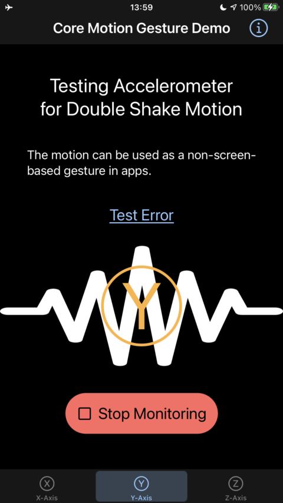

# Core Motion Double Shake Gesture Detection Demo

    
     

In SwiftUI for iOS, we use the accelerometer to detect a custom gesture of a user shaking their device in a double shaking motion.
For example, the Z-axis for an iPhone or iPad corresponds to a perpendicular line projected through the face of the screen when it is positioned parallel to the ground, like a tabletop.
We require a double motion to distinguish a user's signal in a noisy background of detections sensitive to small movements.

- We show a waveform image when we detect a double shake motion.
- The motion can be made with a crisp, double wrist flick, with the final move a little snappier, within a given time window.
- We generate haptic feedback when a gesture is successfully detected.

Please find some notes about the detector listed below.

- The detector has parameters for fine-tuning the gesture.
- Continuously monitoring the accelerometer results in constant CPU usage, about 6%, as measured by Xcode's CPU monitor.

## Install

    $ git clone https://github.com/d108/CoreMotionGesture.git
    $ cd CoreMotionGesture
    $ open CoreMotionGesture.xcodeproj

## Project notes

- SwiftUI and Combine
- MVVM
- Minimum deployment = iOS 14.0

Our app's architectural layers are cleanly separated, enabling smooth handling of all axes, even though we initially coded for only one axis.

### Errors will likely never not happen

To create our detector as a series of events, we utilized a Publisher. If we modify the declaration of our `motionEventPublisher` away from the `Never` in `AnyPublisher<MotionEvent, Never>,` errors can be sent into it.

It is crucial to consider the creation site of `DoubleShakeDetectionView` in `ContentView.swift` to build replacement views properly. Otherwise, the issue may become overwhelming.

Though immutable structs have advantages, imperatively managing complex, nested internal states within them is not recommended. Regenerating a Publisher completed by a failure and all its related dependencies can become messy, as an example.

The views in question have the following form:

    DoubleShakeDetectionView(
        hapticGenerator: hapticGenerator,
        motionEventViewModel: coreMotionGestureViewModel(
            motionDetector(monitorAxis)
        )
    )

### Choosing a site for error handling

To solve our need to handle errors, we have created a `MotionError` that conforms to `LocalizedError` and changed our Publisher to `AnyPublisher<MotionEvent, MotionError>.` Our Publisher contract stipulates that any error will cause completion of the stream by a failure. Consequently, we can align our design to the event stream and consider all operations as completed during an error condition.

In case an error occurs, we can regenerate the entire setup by regenerating the detector view and its dependencies. We won't attempt to recover from errors at a lower level than our Publisher since it is standard operating procedure for immutable value types to return a freshly constructed value.

To handle errors at the site of the detector view's creation, we organize our code by grouping our dependency graph's creation at a single site. We assign a new UUID for a detector view to trigger the regeneration of the entire setup, which we manage in a separate view model. The resulting view factory appears as the following code.

    DoubleShakeDetectionView(
        hapticGenerator: hapticGenerator,
        motionEventViewModel: coreMotionGestureViewModel(
            motionDetector(monitorAxis, motionEventStream)
        )
    ).environmentObject(detectorsViewModel)

## References

Accelerometer axes diagram from https://developer.apple.com/documentation/coremotion/getting_raw_accelerometer_events

## License

Copyright (c) 2023 Daniel Zhang

Permission is hereby granted, free of charge, to any person obtaining a copy
of this software and associated documentation files (the "Software"), to deal
in the Software without restriction, including without limitation the rights
to use, copy, modify, merge, publish, distribute, sublicense, and/or sell
copies of the Software, and to permit persons to whom the Software is
furnished to do so, subject to the following conditions:

The above copyright notice and this permission notice shall be included in all
copies or substantial portions of the Software.

THE SOFTWARE IS PROVIDED "AS IS", WITHOUT WARRANTY OF ANY KIND, EXPRESS OR
IMPLIED, INCLUDING BUT NOT LIMITED TO THE WARRANTIES OF MERCHANTABILITY,
FITNESS FOR A PARTICULAR PURPOSE AND NONINFRINGEMENT. IN NO EVENT SHALL THE
AUTHORS OR COPYRIGHT HOLDERS BE LIABLE FOR ANY CLAIM, DAMAGES OR OTHER
LIABILITY, WHETHER IN AN ACTION OF CONTRACT, TORT OR OTHERWISE, ARISING FROM,
OUT OF OR IN CONNECTION WITH THE SOFTWARE OR THE USE OR OTHER DEALINGS IN THE
SOFTWARE.
